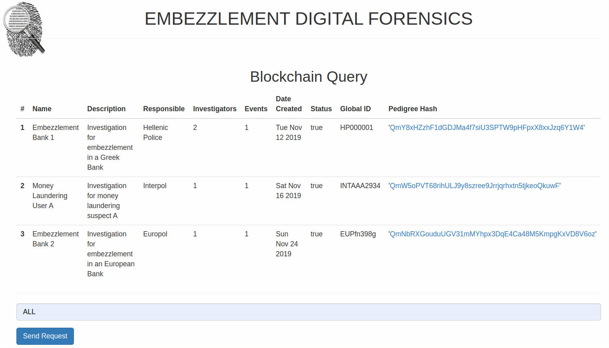
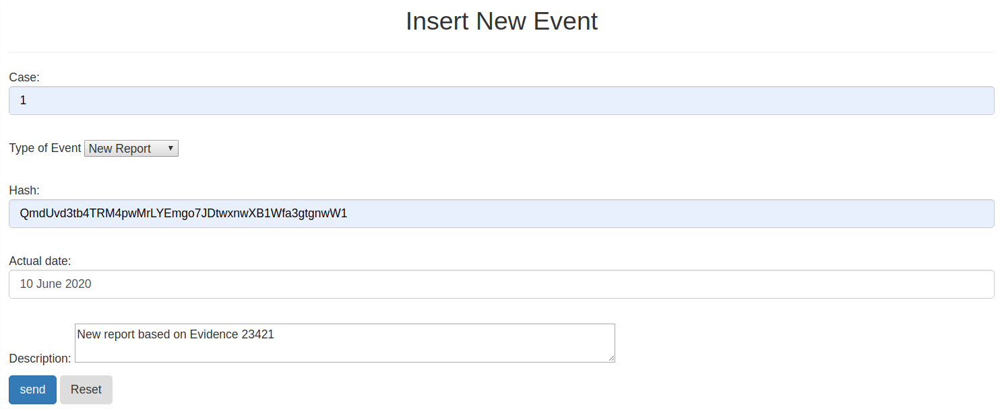

# Digital forensics --financial cybercrime focused--

The project contains smart contract and graphical interface to query and insert new events to the blockchain. 

## Usage

Assuming that you have installed all prerequisites (check https://github.com/francasino/smartContracts):

1. open ganache cli, set gas limit to avoid testing issues

$ ganache-cli --gas-limit 46000000

2. Compile contracts

$ truffle migrate --reset

3. Run graphical interface

$ npm run dev

For testing, in /src/js/app.js you may hardcode one of the addresses created by ganache-cli on top of the file, should Web3API not load properly the address.

